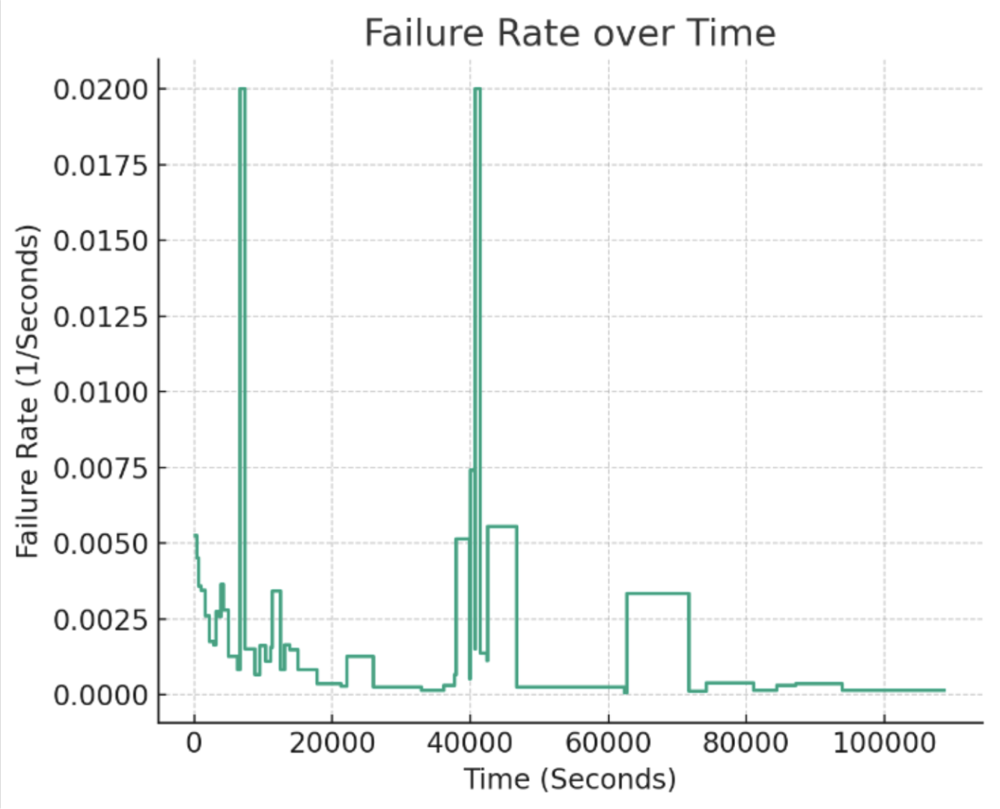

**SENG 438- Software Testing, Reliability, and Quality**

**Lab. Report \#5 – Software Reliability Assessment**

| Group \#:       |   |
|-----------------|---|
| Student Names:  |   |
| Isha Haider     |   |
| Saba Yarandi    |   |
| Zahwa Fatima    |   |

# Introduction

# 

# Assessment Using Reliability Growth Testing 

<ins>ISHAAA: Justification for choice of dataset</ins>

#

<ins>Result of model comparison (selecting top two models)</ins>

_Time Between Failures_

Geometric:

Littlewood:

*Note: The generated Littlewood model performs unexpectedly as it predicts negative values. This is a result of the dataset chosen and its skewed values.

Model comparison in the context of time-between-failures (TBF) data involves evaluating which statistical model better fits the observed data. The two models in question are:

1. Geometric Model: Assumes that the probability of failure is constant in each time interval.
2. Littlewood and Verrall's Bayesian Model: A Bayesian approach to model software reliability which incorporates prior beliefs about the system's reliability and updates these beliefs as failure data is observed.

Based on the graphs provided, the Geometric model (first graph) predicts an increasing trend over time which might be more representative of a system experiencing a "learning effect" where the failure rate decreases as time progresses due to debugging and fixing. The Littlewood and Verrall's Bayesian model (second graph) appears to have a much flatter prediction line, suggesting a more constant failure rate over time, which might indicate that the software system has reached a stability phase.

The scatter of the raw data points (red squares) indicates the actual failure times. In both graphs, the prediction lines (blue line) aim to model this data.

To choose the best model:

- Residuals: Check the residuals (difference between observed and predicted values). The model with residuals closer to zero would typically be a better fit.
- Graphical Analysis: Visually, it seems the Geometric model has increasing residuals, whereas the Bayesian model has residuals that fluctuate around zero but do not show a clear trend. Visually, the Bayesian model may be a better fit.

_Failure Count_

Brooks:

Yamada:

*Note: The Brooks and Yamada models are chosen due to issues in running other STRAT models on our system. These are not necessarily the best models for the chosen dataset. 
Brooks predicts 0 values on this particular dataset. Other datasets run against this such as 6, worked slightly better but not enough to justify Brooks as a suitable model.

1. Brooks and Motley's Discrete Software Reliability Model: This model assumes that failures occur according to a Poisson process with a linearly increasing fault detection rate. It is typically used for early life-cycle software where faults are detected and corrected immediately.

2. Yamada's S-Shaped Reliability Growth Model: This model assumes that software failure occurrence follows an S-shaped curve over time, which indicates an initial learning phase with a slow start in fault detection, acceleration in the middle of the testing phase, and then a slow down as the software stabilizes.

From the graphs provided, it seems that both models are predicting zero failures throughout the intervals, which could suggest that the model parameters are not fitted correctly to the data, or that the models are not suitable for the data at hand. For instance, Brooks and Motley's model (first graph) might not be appropriate if the testing phase is not in its early stages, whereas the S-shaped model might not be fitting well if the software is not showing an S-shaped failure rate over time.

The appropriate model should fit the observed data closely, have reasonable residuals, pass statistical fit tests, have good predictive power, and comply with the principle of parsimony. Given the graphs, it appears that neither model is capturing the observed failure dynamics, suggesting that a re-evaluation of the model parameters or consideration of alternative models might be necessary.

#

<ins>Result of range analysis (an explanation of which part of data is good for proceeding with the analysis)</ins>

_Time Between Failures_

The statistical summary of the time-between-failures data provides insights into the distribution of the failure times:

- There are 54 failure events in total.
- The mean time-to-failure is about 2013 seconds, but there is a large standard deviation of approximately 2966 seconds, indicating a wide spread in the data.
- The minimum reported time-to-failure is 0 seconds, which occurs twice. These are likely to be anomalies or data entry errors since a time-to-failure of 0 is not realistic in most contexts.
- The 25th percentile is approximately 295 seconds, the median (50th percentile) is 668 seconds, and the 75th percentile is 2666 seconds.
- The maximum time-to-failure is 15600 seconds.

For further analysis, it is advisable to remove the anomalies (zero values) since they can distort the reliability analysis. A good range of data to proceed with would exclude these outliers. Thus, excluding failure numbers 44 and 45, which have zero values, would be a good starting point.

The next step would typically involve further outlier detection, potentially through visual methods like a boxplot, or using statistical tests to determine if any other data points should be considered outliers and excluded from the reliability analysis. Let's plot a boxplot for a better visualization.

The boxplot of the time-to-failure data, with zero values excluded, reveals the spread of the data and any potential outliers. From the plot, we can observe the following:

- The central box represents the interquartile range (IQR), which covers the middle 50% of the data.
- The horizontal line inside the box denotes the median of the data.
- The "whiskers" extend to 1.5 times the IQR from the 25th and 75th percentiles. Data points beyond the whiskers are considered outliers.

In this case, there are several data points that lie beyond the whiskers and could be considered outliers. These points might represent abnormal or rare events that could skew the analysis.

For a range analysis, consider data within the whiskers for the initial modeling phase. However, the significance of the outliers should be evaluated in the context of the software and its operational environment. If these outliers represent genuine failure events that are expected as part of the software's behavior, they should be included in the analysis. Conversely, if they represent anomalies or data entry errors, they should be excluded.

_Failure Count_

The boxplot of the failure count data shows the distribution and identifies potential outliers. Observations can be made as follows:

- The box, representing the interquartile range (IQR), shows the middle 50% of the data.
- The median is represented by the line within the box.
- The "whiskers" extend to 1.5 times the IQR from the 25th and 75th percentiles. Points beyond the whiskers can be considered outliers.
- The data has several points at 0, which may represent periods without failures. These are not outliers but indicate intervals of system stability or effective operation without failures.
- There is an outlier at the high end, which indicates a time period with an unusually high number of failures.

In the context of failure count data, zero counts can be significant as they indicate periods of reliability. For the range analysis, all data points, including those with zero failures, are typically considered valid for proceeding with reliability analysis. The outlier with a high number of failures should be investigated to determine if it results from a specific cause that is not representative of the system's normal operation. If it is an anomaly due to extraordinary circumstances (like a stress test or major change), it might be excluded from the analysis; otherwise, it should be included as part of the overall reliability assessment.

The main consideration for proceeding with analysis is the consistency of data collection and the representativeness of the data for the system's operation. The good range for analysis would generally include all time periods unless there are specific reasons to exclude certain data points after careful consideration.

#

<ins>Plots for failure rate and reliability of the SUT for the test data provided</ins>

Here are the plots for the failure rate and the reliability of the System Under Test (SUT) based on the test data provided:

- The Failure Rate plot shows the failure rate over time, with each step corresponding to a new failure. This rate is calculated as the inverse of the time-to-failure, and it is evident that the failure rate has significant spikes, especially after longer periods without failure, which suggests that failures are not occurring at a constant rate over time.

- The Reliability plot indicates the probability that the system will perform without failure up to a certain time. It's calculated using the exponential reliability function and shows a stepwise decrease as failures occur. The reliability starts very high (near 1, which is 100%) and decreases slightly with each failure, remaining relatively high throughout the observed period, which indicates that the system maintains a high level of reliability over the time frame of the failures recorded.

These plots provide insight into the performance and reliability of the SUT during the testing period. The reliability plot, in particular, suggests that despite failures, the system is generally performing reliably. However, the relatively high failure rate at certain points might be a cause for investigation to identify potential areas for improvement in the system.

#

<ins>A discussion on decision making given a target failure rate</ins>

When making decisions in the context of software reliability, a target failure rate is often set based on the required level of service, the criticality of the application, and user expectations. Given a target failure rate, the decision process will proceed as follows:

1. Evaluate Current Failure Rate: Using the failure rate plot, determine whether the current failure rate of the system is above, at, or below the target failure rate. If the failure rate is consistently above the target, this indicates that improvements are needed.

2. Identify Patterns: Look for patterns in the failure data. Are there spikes in failure rates after new releases or during specific time frames? Understanding the context of failures can help in pinpointing issues that need to be addressed.

3. Assess Reliability Trends: Use the reliability plot to understand how system reliability changes over time. A reliability that declines faster than expected indicates potential systemic issues or codebase instability.

4. Consider Criticality: The acceptable failure rate might be different for different parts of the system. Systems that perform critical functions may have a lower acceptable failure rate than less critical ones.

5. Investigate Outliers: Any anomalies or outliers in the failure data should be investigated. High failure rates at specific points may indicate defects, external system stress, or other issues that could inform where to focus development and testing efforts.

6. Implement Improvements: If the failure rate exceeds the target, consider strategies for improvement. This could include code refactoring, increased test coverage, additional testing types like load or security testing, or process changes such as implementing continuous integration/continuous deployment (CI/CD) pipelines.

7. Monitor Changes: After implementing changes, continuously monitor the failure rate and reliability. This monitoring will reveal whether the changes are effective at reducing the failure rate towards the target.

In conclusion, decision-making with respect to a target failure rate involves a combination of data analysis, understanding the implications of failures, strategic planning to improve reliability, and continuous monitoring to ensure that the system meets the established reliability goals.

#

<ins>A discussion on the advantages and disadvantages of reliability growth analysis</ins>

| Advantages                                          | Disadvantages                                         |
|-----------------------------------------------------|-------------------------------------------------------|
| 1. Predictive Power:                               | 1. Complexity:                                        |
|    It allows for the prediction of future system   |    The statistical models and methods involved in    |
|    behavior based on historical data. This can     |    reliability growth analysis can be complex and    |
|    help in planning for maintenance and resource   |    require specialized knowledge to apply correctly. |
|    allocation.                                     |                                                       |
|                                                     |                                                       |
| 2. Informed Decision-Making:                       | 2. Data Dependency:                                   |
|    Reliability growth analysis can inform          |    Reliable predictions require high-quality data. If |
|    stakeholders about the current state of system  |    the failure data is poor or there are data        |
|    reliability, helping to make data-driven        |    collection issues, the analysis can be misleading.|
|    decisions regarding product release and         |                                                       |
|    resource investment.                            |                                                       |
|                                                     |                                                       |
| 3. Identification of Trends:                       | 3. Time-Consuming:                                    |
|    It can identify trends in reliability          |    Gathering and analyzing the data necessary for    |
|    improvement or degradation, which is essential |    reliability growth analysis can be time-consuming. |
|    for understanding the effectiveness of the     |                                                       |
|    development process and the impact of changes.  |                                                       |
|                                                     |                                                       |
| 4. Focus on Improvement:                           | 4. Resource Intensive:                                |
|    The analysis can pinpoint areas where           |    It can be resource-intensive, requiring dedicated |
|    reliability growth is not meeting expectations, |    personnel and computational resources for          |
|    thus focusing development and testing efforts   |    continuous monitoring and analysis.               |
|    where they are needed most.                     |                                                       |
|                                                     |                                                       |
| 5. Optimizing Test Strategies:                     | 5. Dynamic Environments:                             |
|    It helps in optimizing testing strategies by   |    Reliability growth models may not account for     |
|    understanding how additional testing impacts    |    dynamic operational environments where the system |
|    the system’s reliability.                      |    is subject to varying stresses and workloads.     |
|                                                     |                                                       |
|                                                     | 6. Assumption-Based:                                 |
|                                                     |    Many models rely on assumptions about failure    |
|                                                     |    mechanisms and repair effectiveness, which may    |
|                                                     |    not hold true for all systems.                   |
|                                                     |                                                       |
|                                                     | 7. Over-Optimization:                                |
|                                                     |    There’s a risk of over-optimizing for the test   |
|                                                     |    environment, which might not translate to        |
|                                                     |    real-world reliability.                           |

In conclusion, while reliability growth analysis is a powerful tool for understanding and improving the reliability of systems, it requires careful consideration of the quality of the input data, the appropriate use of statistical models, and the resources available for analysis. It should be used as part of a broader decision-making framework that considers technical, financial, and operational factors.

# 

# Assessment Using Reliability Demonstration Chart 

<ins>Plot 1: MTTFmin</ins>

<ins>Plot 2: Twice MTTFmin</ins>

<ins>Plot 3: Half MTTFmin</ins>

<ins>ISHAAA: Explain your evaluation and justification of how you decide the MTTFmin</ins>

<ins>ISHAAA: A discussion on the advantages and disadvantages of RDC</ins>

# ISHAAA: Comparison of Results

# ISHAAA: Discussion on Similarity and Differences of the Two Techniques

# ISHAAA: How the team work/effort was divided and managed

# 

# ISHAAA: Difficulties encountered, challenges overcome, and lessons learned

# Comments/feedback on the lab itself

No comments or feedback :)
